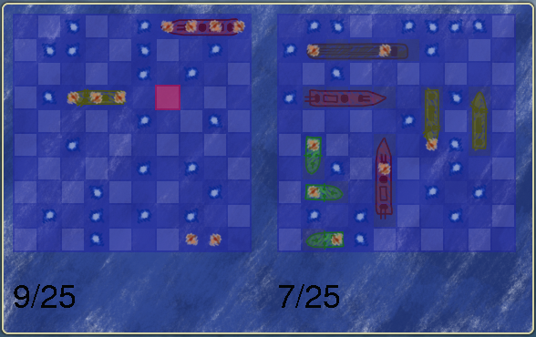

# Battleship-SDL

Battleship-SDL is a simple implementation of the classic [Battleship](https://en.wikipedia.org/wiki/Battleship_(game)) game in C++ using the SDL2 library.

## Installation

1. Install dependencies: SDL2, SDL2_image, SDL2_ttf.
2. Build: `mkdir build && cd build` then `cmake . && make`
3. Run: `./battleship`
